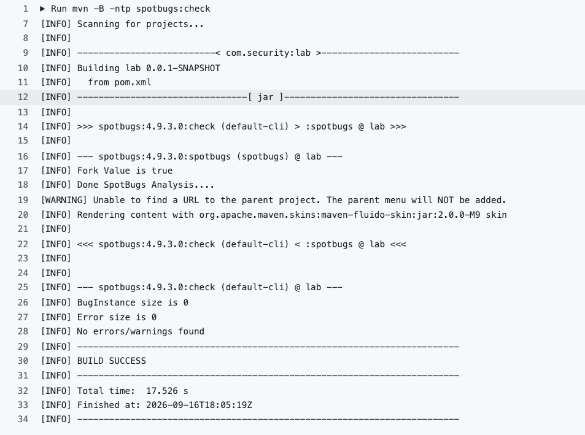
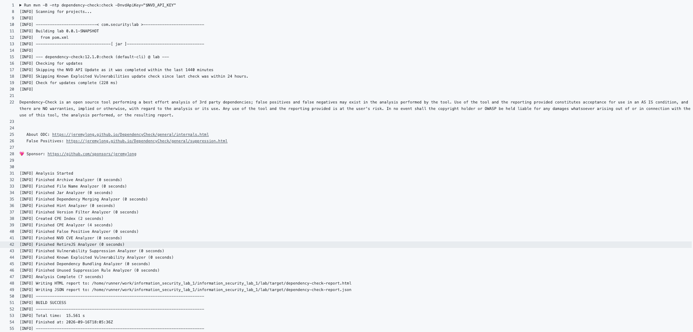

# Лабораторная работа №1 «Разработка защищенного REST API с интеграцией в CI/CD»

Предмет: «Информационная безопасность», НИУ ИТМО, ФПИиКТ.
Выполнил: Федоров Евгений Константинович, группа P3410.

## Оглавление

- [Инициализация проекта](#инициализация-проекта)
- [Описание проекта](#описание-проекта)
- [Список эндпоинтов](#список-эндпоинтов)
- [Защита от SQL-инъекций](#защита-от-sql-инъекций)
- [Защита от XSS-атак](#защита-от-xss-атак)
- [Реализация аутентификации пользователя](#реализация-аутентификации-пользователя)
- [Полученные отчеты по SAST/SCA из Actions](#полученные-отчеты-по-sastsca-из-actions)

## Инициализация проекта

Для данного проекта был создан репозиторий Git, который был связан с репозиторием на GitHub.
Ссылка на репозиторий: <https://github.com/2BuRy1/information_security_lab_1>

## Описание проекта

В данной работе было реализовано REST API приложение с поддержкой аутентификации при помощи JWT-токена.
У аутентифицированных пользователей есть возможность просмотра других зарегистрированных в системе
пользователей, отправки им сообщений по логину и просмотра собственных сообщений.

Приложение написано на Java 17 с использованием Spring Boot (Spring Web MVC, Spring Security,
Spring Data JPA), в качестве СУБД используется PostgreSQL, для сборки и запуска проверок — Maven.

## Список эндпоинтов

### POST /auth/register — регистрация

Формат запроса:

```json
{
  "login": "alice",
  "password": "alicepass",
  "repeatedPassword": "alicepass"
}
```

Формат ответа:

```json
{
  "token": "some_token"
}
```

### POST /auth/login — вход

Формат запроса:

```json
{
  "login": "alice",
  "password": "alicepass"
}
```

Формат ответа:

```json
{
  "token": "some_token"
}
```

### GET /api/data — получение списка зарегистрированных пользователей

Формат ответа:

```json
[
  {
    "id": 53,
    "login": "bob"
  }
]
```

### POST /api/messages — отправить сообщение

Формат запроса:

```json
{
  "recipient": "bob",
  "text": "hey, bob!"
}
```

Формат ответа:

```json
{
  "id": 1,
  "from": "alice",
  "to": "bob",
  "text": "hey, bob!",
  "createdAt": "2026-09-15T21:42:48.60984"
}
```

### GET /api/messages — получить все сообщения

Формат ответа:

```json
[
  {
    "id": 1,
    "from": "alice",
    "to": "bob",
    "text": "hey, bob!",
    "createdAt": "2026-09-15T21:42:48.60984"
  }
]
```

## Защита от SQL-инъекций

Защита от SQL-инъекций обеспечивается использованием Spring Data JPA поверх Hibernate.
Все обращения к БД идут через методы репозиториев, которые Hibernate транслирует в
параметризованные подготовленные запросы (PreparedStatement) согласно спецификации JPA.
Конкатенации строк при построении SQL в проекте нет ни в одном месте, пользовательские
данные всегда передаются как связанные параметры, а не встраиваются в текст запроса.

## Защита от XSS-атак

Приложение является чистым REST API и не генерирует HTML: все ответы отдаются в формате application/json и сериализуются библиотекой Jackson, входящей в Spring Boot. Jackson при сериализации экранирует специальные и управляющие символы (кавычки, переводы строк и т.д.) по правилам JSON.
Дополнительно реализована защита при помощи экранирования специальных символов HTML средствами фреймворка.

## Реализация аутентификации пользователя

В работе используется JWT access-токен. Access-токен служит для доступа к защищённым
эндпоинтам: именно по нему определяется пользователь. Время жизни токена — 1 час, токен
подписывается алгоритмом HS256 секретным ключом.

Токен выдаётся при регистрации `POST /auth/register` и при входе `POST /auth/login`.

На защищённых эндпоинтах стоит фильтр — он проверяет наличие и формат заголовка
`Authorization: Bearer <токен>`, проверяет подпись и срок действия, загружает пользователя
из БД и устанавливает аутентификацию.

В базе данных пароли хранятся только в виде хэшей bcrypt,
сырые пароли нигде не сохраняются и не логируются.

## Полученные отчеты по SAST/SCA из Actions

Отчет SAST:



Отчет SCA:


